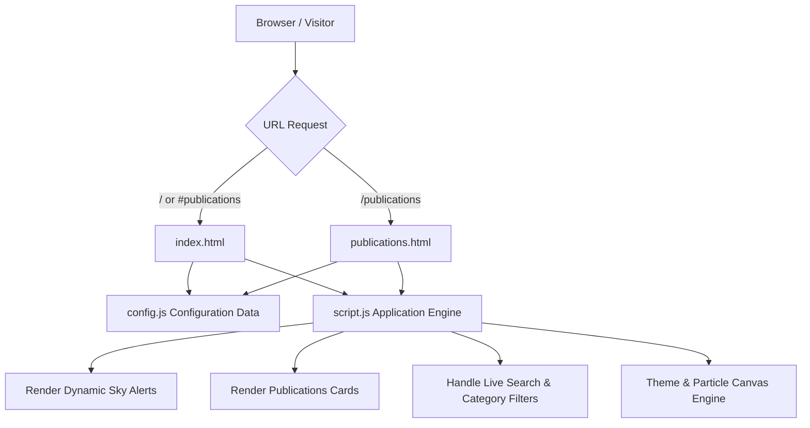
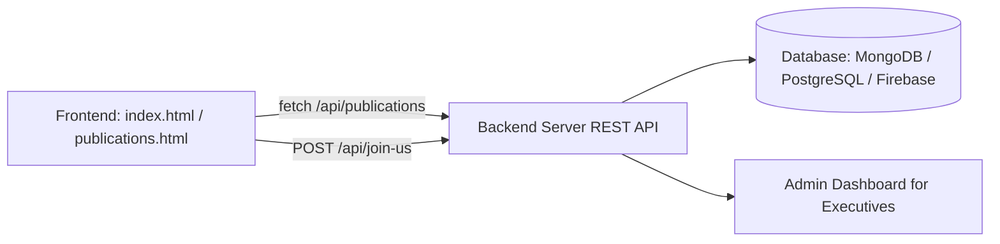

# SLIET Antriksha Vigyan Society (SAVS)

> **Official Space & Astronomy Society Website for Sant Longowal Institute of Engineering and Technology (SLIET Longowal).**

Designed with a state-of-the-art **Glassmorphism UI**, interactive starfield particle canvas, dynamic astronomical calculations, publication research engine, team filters, and fully responsive cross-device layout.

---

## ✨ Features & Modules

- ☀️ **Adaptive Glassmorphism Theme:** Light Mode default design with instant Sun/Moon theme switcher and localStorage state persistence.
- 🌌 **Interactive Starfield Canvas:** Dynamic particle physics background that seamlessly shifts color hues between Light and Dark themes.
- 🔭 **Real-Time Astronomical Alerts & Sky Watch:** Auto-calculating astronomical alert widget predicting seasonal events, meteor showers (e.g. Perseids, Geminids), and moon phases for SLIET's geographic coordinates (30.23°N).
- 👨‍🏫 **Faculty Leadership Profile:** Highlights Faculty Head & Society Mentor **Dr. Ravi Kant Mishra** (Professor & Dean, Alumni & Industrial Relations).
- 📚 **Research Publications Engine:**
  - Dedicated Research Publications module on both main landing page (`#publications`) and standalone route ([publications.html](file:///Users/priyanshuraj/Developer/Projects/slietantrikshavigyansociety/publications.html)).
  - Verified peer-reviewed papers in Cosmology, Astrophysics, and Space Tech authored exclusively by Dr. Ravi Kant Mishra.
  - Interactive search bar, topic category filters (*Cosmology*, *Astrophysics*, *Space Tech*), and official portal redirect banner ([rkmishra.com/publication](https://rkmishra.com/publication)).
- 📅 **Interactive Events Hub:** Category filtering between upcoming flagship events and past session highlights.
- 👥 **Team Directory:** Filterable views for Faculty Leadership, Core Team, and Student Leads.
- 📑 **Join Us Application Portal:** Recruitment modal with direct Google Form integration and instant submission feedback.
- 🚀 **Clean URL Routing:** Pre-configured Vercel rewrites (`vercel.json`) and GoDaddy Apache server rules (`.htaccess`) for clean `/publications` URL routing without 404s.

---

## 📁 Repository Structure

```text
slietantrikshavigyansociety/
├── index.html          # Main landing page & section hub
├── publications.html   # Standalone page for /publications route
├── config.js           # Centralized site configuration & publications data
├── script.js           # Core application logic, canvas physics, search & filters
├── style.css           # Glassmorphism utilities & custom CSS styles
├── vercel.json         # Vercel deployment rewrites & routing rules
├── .htaccess           # Apache server rules (HTTPS, Gzip compression, rewrites)
├── manifest.json       # Web application PWA manifest
├── robots.txt          # Search engine crawler directives
├── sitemap.xml         # Search engine index sitemap
├── EDITING_GUIDE.md    # Step-by-step beginner maintenance guide
└── images/             # Society graphics (logo.png, favicon.png, faculty photos)
```

---

## 🔄 Current Website Workflow Architecture



1. **Config-Driven Data Layer (`config.js`):** All dynamic parameters—such as Google Form URLs, Faculty Head bio, astronomy alerts, and research publications array—are stored centrally in `window.CLUB_CONFIG`.
2. **Client-Side Rendering Engine (`script.js`):** Parses `config.js` on page load, populating publication cards, category filters, real-time date/year calculations, and particle canvas rendering.
3. **Dual-Route Resolution:** Visitors accessing `/publications` are seamlessly served via `vercel.json` rewrites or `.htaccess` rules without page reloads or broken links.

---

## 🔌 Future Backend & API Integration Roadmap

While the site currently runs fast and lightweight as a static, config-driven application, it is designed for effortless backend integration when needed:



### Planned Backend Features:
1. **REST API for Publications & Events:** Replace static arrays in `config.js` with async `fetch('/api/publications')` and `fetch('/api/events')` calls.
2. **Dynamic Application Submissions:** Replace external Google Forms with a custom backend endpoint (`POST /api/applications`) storing student join requests directly into a database.
3. **Admin CMS Portal:** Develop a secure executive login portal (`/admin`) for non-technical student leads to upload publications, add event photos, and export applicant CSVs directly without editing code.

---

✨ *Maintained by the SLIET Antriksha Vigyan Society Tech Team.*